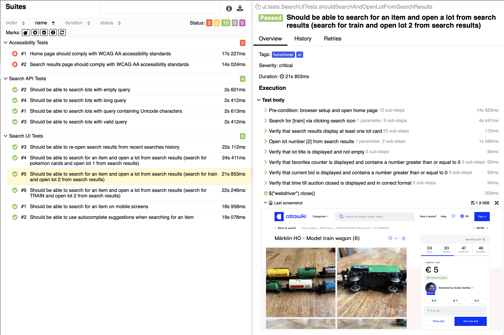

# Catawiki Automation Assignment

## Overview

This project contains automated UI and API tests for the Catawiki platform.

The main focus areas of the assignment are:

* search functionality
* lot page validation
* API negative/edge-case handling
* accessibility checks
* responsive/mobile behavior exploration

The implementation was intentionally kept lightweight and maintainable, with focus on readability, stability, and meaningful assertions rather than excessive test count.

Test report:



---

# Tech Stack

* Java
* Selenide (UI automation)
* REST Assured (API testing)
* JUnit 5
* Hamcrest
* Allure HTML Reports
* Axe Accessibility Engine

---

# Getting Started

**Required**:
1. [Java 21](https://jdk.java.net/archive/)
2. [Apache Maven](https://maven.apache.org/install.html)

If you're using [Homebrew](https://brew.sh), run:

`brew install openjdk@21`

`brew install maven`

**Optional**: to be able to generate and view test report, install [Allure Report](https://allurereport.org/docs/v2/install/).

# Running Tests

## Run all tests

```bash
mvn clean test
```

## Run tests on a specific browser

```bash
mvn clean test -DbrowserType=chrome
```

Supported browser values depend on local WebDriver/browser setup.

Examples:

```bash
mvn clean test -DbrowserType=firefox
mvn clean test -DbrowserType=edge
mvn clean test -DbrowserType=safari
```

---

# Configuration

The following parameters are configurable:

```properties
baseUrl=https://www.catawiki.com/
locale=en
browserType=chrome
isHeadlessBrowser=false
```

Configuration can be provided in two ways:

1. Through `src/test/resources/test-config.properties`
2. Through command-line system properties

Example:

```bash
mvn clean test -DbrowserType=firefox -DisHeadlessBrowser=true
```

Command-line parameters override values from the properties file.

---

# Parallel Execution

JUnit 5 parallel execution is enabled to improve execution speed.

---

# Test Reports

Allure reporting is integrated for detailed execution reporting.

## Generate & Open Allure report

```bash
allure serve
```
### Note
Generating reports requires installing Allure.

To view existing test report without installing Allure open `allure-report/index.html` in browser.

---

# Test Coverage

## UI Tests

The UI suite focuses primarily on positive/happy-path user scenarios.

Covered areas include:

* Searching for auction lots
* Opening lot details page
* Validation of lot information:

    * lot title
    * favorites counter
    * current bid
* Countdown/timer format validation
* Basic responsive/mobile behavior checks
* Accessibility validation for selected pages/components

### Notes

Search relevancy assertions were intentionally kept flexible because search results appear to be indexed using multiple fields (not only lot titles), and exact ranking/relevancy may change dynamically.

Responsive/mobile testing exploration revealed that mobile view uses substantially different UI structure and component layout compared to desktop view. For the scope of this assignment, mobile coverage was limited to core interaction validation rather than introducing a dedicated mobile page-object hierarchy.

---

## API Tests

The API suite focuses mainly on negative and edge-case scenarios.

Covered examples include:

* Empty search query
* Special-character queries
* Long query handling
* General response validation

The goal of these tests is to validate API robustness and stability rather than exact dataset contents.

---

# Project Structure

```text
src
├── test
│   ├── java
│   │   ├── api
│   │   │   ├── assertions
│   │   │   ├── clients
│   │   │   ├── dto
            └── tests
│   │   ├── ui
│   │   │   ├── elements
│   │   │   ├── pages
│   │   │   └── tests
│   │   └── utils
│   │
│   └── resources
```

---

# Design Decisions

## Page Object Model

The project uses Page Object Model with fluent-style method chaining for readability and expressive test flow.

Example:

```java
searchResultsPage
    .shouldContainLotCards()
    .openLotNumber(lotNumber)
    .shouldHaveLotTitle()
    .shouldHaveFavoritesCount()
    .shouldHaveCurrentBid();
```

The intention behind this approach is to keep tests concise, readable, and business-flow oriented.

---

## Synchronization Strategy

Selenide's built-in smart waits and condition-based synchronization are used throughout the project.

The framework intentionally avoids:

* hardcoded sleeps
* unnecessary explicit waits
* timing-based synchronization
